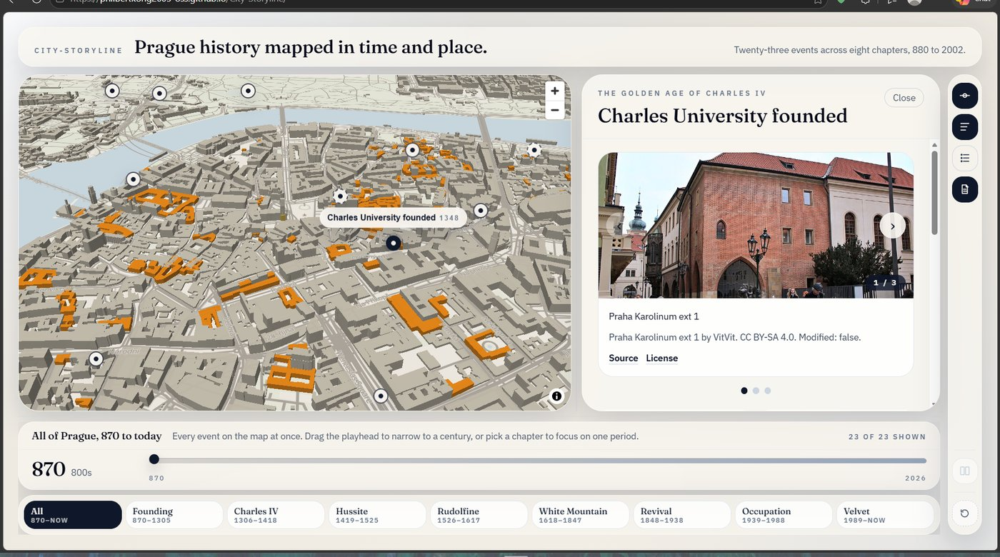

# City-Storyline

**Live site: https://philbertkong2005-oss.github.io/City-Storyline/**

Tier-0 of a static, single-page historical map of Prague built with React, TypeScript, Vite, Tailwind, MapLibre, Zustand, and Zod.



## Commands

```bash
npm install
npm run dev
npm run validate:content
npm run build
```

## Notes

- GitHub Pages deploys from `.github/workflows/deploy.yml`.
- Vite `base` is fixed to `/City-Storyline/` for the public Pages URL.
- The vector tile source is isolated in `src/lib/mapStyle.ts` as `TILE_SOURCE` for one-line provider swaps if needed.
